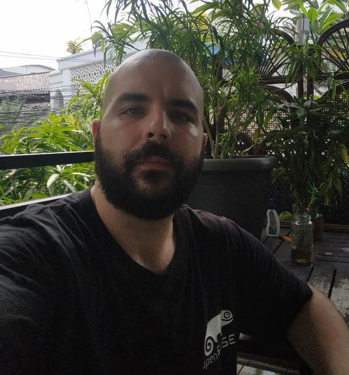
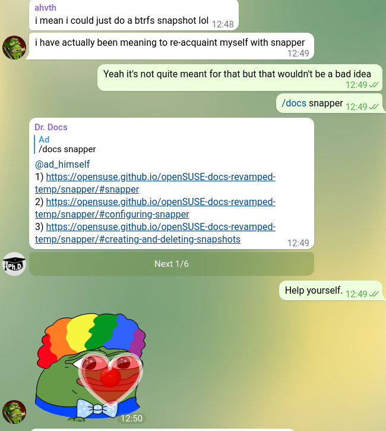

# openSUSE docs: Tame the beast, make it a friend

    

    Adrien Glauser (nycticorax@opensuse.org)
    
    

    
Attila Pinter (adathor@opensuse.org)
    
    

---

# Who are we?

--

Attila:

* lives in Indonesia
* DevOps and SysAdmin
* entrepreneur -- works for the company he has founded

Adrien: 

* lives in Switzerland
* ~90% of a PhD in something to do with concepts and linguistics
* Python and Haskell fanboy

---

# Menu

1. Now and how it started.
2. Tumbleweed and Whyw wikis are at trap.
3. Why moving docs under maintainership does not solve all problems.
4. Saving the world.
5. Why documentation is underrated.

---

# 1|5 A Look Back

Started late November 2020.

It started well: https://github.com/openSUSE/openSUSE-docs-revamped-temp/graphs/contributors

The goal was to have the 9 first sections of the table of contents covered by the summer 2021: 
* https://github.com/openSUSE/openSUSE-docs-revamped-temp/blob/dev/ToC.md

We have about 6 done already, but we are slightly beyond schedule.

Why? How lazy and incompetent can we be?

---

# 1|5 A Look Back

How did we get into documentation? The altruist reasons

Takes some weight off the shoulders of user support.

Makes sure time and energy are not spent twice.
* when someone finds oneself scratching their head in front of an already solved problem, there's a waste 

Equalizes opportunities.
* if you are not lucky enough to talk to the most knowledgeable people (think of separate linguistic communities), you are worse off everybody else who are lucky enough to know someone around who can help.

---

# 1|5 A Look Back

How did we get into documentation? The egoistic reasons

Ddocumenting something tests your understanding of it.

Committing to documentation is a nice incentive for learning.

---

# 2|5 Tumbleweed

The state of the Tumbleweed documentation

Tumbleweed takes some understanding to be taken advantage of. What does the documentation look like for people interested in TW?

__The official Leap reference manuals?__

_No_ : they don't talk about Tumbleweed at all; they talk only about tools common to Leap and TW.
* this falls short, as the workflow between rolling and fixed-point release is so different

__The openSUSE wikis, especially the SDB?__

_No cigar_ : there is no explicit and visible maintainership, so you cannot trust anything.
* that's because you don't know who's vouching for what you're reading

---

# 2|5 Tumbleweed

Why wikis are usually not great for important things that need updating

Absence of visible maintainership means that truth is contaminated with uncertainty.

How to tell up-to-date and factually correct from outdated or incorrect? 

__You cannot tell apart up-to-date + factually correct and recommended parts from the parts that aren't.__
* the user has no rational option but to try and pray (or worse: go Fedora or Ubuntu...)

Wikis work just like GitHub repositories: when you can honor the implicit contract with the user that contents are curated and maintained.

---

# 2|5 Tumbleweed

Objections and replies

But Wikipedia? 
* they pay people

But Arch?
* they use wiki categories as GitHub repositories; 80% of the contents are written by 20% of the contributors, just like repos

We use GitHub to simply make explicit the contract between maintainers and users that others distros leave implicit:
* "Dear user, we hereby promise that everything you'll find is factually correct or recommended for as long as we offer it..."

We embrace the fact that good docs is like a wetmarket: it's (hopefully) fresh and there are people to serve you.

---

# 2|5 Tumbleweed

Matter of facts

* Pick X or Y in the installer" if I want to do Z?
* I am booting to a black screen. How to use an Nvidia + some other GPU?
* How to get software X?
* How to update / upgrade?

Matter of recommendation

* How often should I update?
* How should I solve conflicts between dependencies?
* Should I use zypper or Yast? zypper or dnf? tool X or Y?

So Documenting TW cannot do away with recommendations:

---

# 2|5 Tumbleweed 

Takeaway

The more people know, the more they're pushing their system and questioning the defaults, until their questions cannot be met only on technical facts

openSUSE and Tumbleweed in particular are appealing to people eager to learn and tinker with their system, so good docs are required to honor this implicit promise: __the risks inherent to the rolling-release model are worth taking__.

---

# 3|5 Maintainership does not solve it all

Cherry-picked example: setting up offload to an Nvidia GPU

* Leap official documentation: https://doc.opensuse.org/documentation/leap/reference/single-html/book-reference/index.html#sec-gui-desktop-suse-prime
* openSUSE wikis (SDB): https://en.opensuse.org/SDB:NVIDIA_SUSE_Prime
* but also, forums: https://forums.opensuse.org/
* not to forget a friendly gecko at: https://opensuse-guide.org/3d.php

Too many sources, giving similar but slightly different tips, published at different times.
* we don't want to control what third-parties say about our beloved distribution, so we have to either work with them or compete with them
* we cannot compete with them unless we present a single source of truth (and recommendations!) to the user -- which means removing redundancies
* which means __deleting__ the work of others unless they can be __quickly identified and persuaded__ to merge their contents with ours.

---

# 3|5 Maintainership does not solve it all

Meeting our own reviewing ambitions

Our reviewing process: on a new submission review

1. review structure & contents
2. review language, style and punctuation
3. rewiew again structure & contents
4. ewview again language, style and punctuation

(1) is in-house.

(2) and (3) need experienced and knowledgeable contributors for peer-reviewing (devs / maintainers).

Even when they are flawless for technical facts, they don't always agree to making recommendations.

Or they don't have time to explore recent use cases, so as to make an informed recommendation.

__Problem is__: We are working on the docs at a time where there is no tradition of such a reviewing process to hook onto!

---

# 3|5 Maintainership does not solve it all

Tech more integrated than people.

Yast2, zypper, snapper -- those are at the core of the openSUSE user experience, and quite neatly integrated with the operating systems

Yet there is a mismatch between the level of integration of these tools and the level of integration / coordination of the people maintaining them

Not a criticism: it's bound to happen in a world where you need to specialize

What would help would be specific time windows or places where potential reviewers can be identified and invited to reviewing
* Progress, Pagure?

---

# 4|5 Docs is underrated

Silver linings !

---

# 4|5 Docs is underrated

Good for others

Relieving user support means more people for contributing to other areas.

__Demo Time__
* check out how the docs bot allows us to avoid repetitions

---

# 4|5 Docs is underrated

Good for you

It's instantly rewarding. Sometimes we add something to the docs which is used one hour later to enable a user to avoid this or that pitfall. 

Learning by teaching complements learning by doing.

Writing and integrating documentation is easy to reference and take advantage of in a curriculum.

---

# 5|5 Saving the world
(And how to make it happen)

Imagine a world where:

1. _(Reportability)_ Whenever a user finds gappy / outdated / incorrect contents, they can report it to the documentation team through a simple procedure.

2. _(Waiting room)_ When the docs team needs a reviewer, they can broadcast their requirements to a "waiting room" of people interested in reviewing, who can pick up the task(s) they're interested in as they come.

3. _(Traceability)_ All contributions -- be it writing the docs or reviewing it -- is easy to trace to their author(s) and to reference from a curriculum.

---

# 5|5 Saving the world

Conclusion

The docs is a precious navigational instrument: it helps a community know where it's heading and helps it remember where it comes from because it embodies a particular history and tradition.

Used in conjunction with good feedback mechanisms (like the _End of the Year_ surveys ;P) it makes for one of the most beautiful place you can contribute in openSUSE.

Thanks for your attention!

Our repo: https://github.com/openSUSE/openSUSE-docs-revamped-temp
Our Telegram group chat (bridged to Matrix / Discord): https://t.me/opensuse_docs

_If you want, you can read -- and even serve -- the slides at https://github.com/why-not-try-calmer/openSUSE-Conference-2021_!